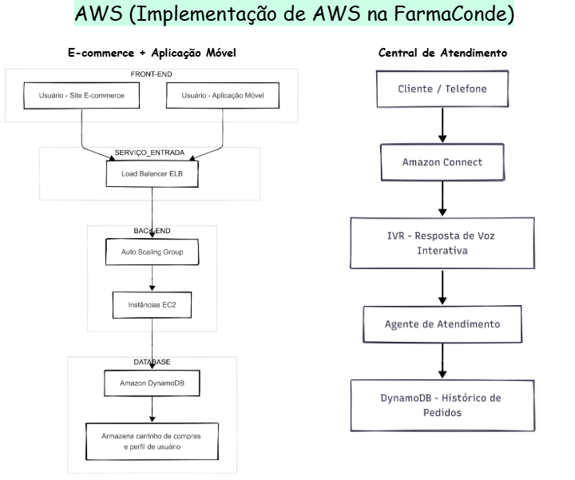

# Relatório de Implementação de Serviços AWS

**Case:** Implementação de Soluções AWS na FarmaConde  
**Data:** 28/08/2025  
**Empresa:** FarmaConde  
**Responsável:** Danielle Costa 

---

## Introdução
Este relatório detalha o processo de implementação de soluções AWS na empresa **FarmaConde**, realizado por **Danielle Costa**.  
O objetivo principal do projeto foi selecionar e aplicar três serviços AWS para:  
- Reduzir custos operacionais;  
- Otimizar a escalabilidade;  
- Melhorar a experiência do cliente.  

---

## Descrição do Projeto
O projeto foi estruturado em três etapas, cada uma voltada para solucionar problemas específicos na infraestrutura de TI da FarmaConde.

### Etapa 1: Amazon EC2 (com Auto Scaling)
**Foco:** Hospedagem do sistema de e-commerce e aplicação móvel.

**Descrição do caso de uso:**  
O sistema de e-commerce da FarmaConde sofria com picos de tráfego durante promoções e horários de pico, resultando em lentidão e, em alguns casos, falhas. O uso do Amazon EC2 combinado com Auto Scaling resolveu esse problema. Agora, a infraestrutura ajusta automaticamente o número de servidores (instâncias EC2) para lidar com o aumento da demanda, garantindo que o site e o aplicativo estejam sempre rápidos e disponíveis. Durante períodos de menor tráfego, o Auto Scaling reduz o número de instâncias, economizando custos com infraestrutura ociosa.

---

### Etapa 2: Amazon DynamoDB
**Foco:** Armazenamento de dados de carrinhos de compra, sessões de usuário e perfis de cliente.

**Descrição do caso de uso:**  
O sistema anterior para gerenciar dados de carrinhos de compra e sessões de usuários não era escalável para as centenas de milhares de usuários do site e aplicativo. A implementação do Amazon DynamoDB, um banco de dados NoSQL totalmente gerenciado, permitiu o armazenamento de dados com alta performance e baixa latência, independentemente do volume. O DynamoDB garante que a experiência do usuário seja fluida e que as informações de seu carrinho de compras estejam sempre disponíveis, sem a necessidade de gerenciar complexos clusters de banco de dados.

---

### Etapa 3: Amazon Connect
**Foco:** Central de atendimento e suporte ao cliente.

**Descrição do caso de uso:**  
A central de atendimento da FarmaConde operava com um sistema on-premise caro e inflexível. A adoção do Amazon Connect permitiu a criação de uma central de atendimento na nuvem em questão de horas. A solução oferece ferramentas de autoatendimento personalizáveis (IVR) e encaminha chamadas para os agentes de forma inteligente. Isso reduziu os custos operacionais e permitiu à FarmaConde escalar a equipe de atendimento facilmente em épocas de alta demanda, como a temporada de gripe, além de fornecer um melhor serviço e experiência para o cliente.

---

## Conclusão
A implementação dos serviços AWS gerou benefícios significativos:  
- Melhor escalabilidade e performance dos sistemas online;  
- Otimização de custos com infraestrutura;  
- Modernização da central de atendimento.  

**Recomendações:**  
- Expandir o uso da nuvem para outros setores da empresa;  
- Considerar **Amazon Redshift** para análise de grandes volumes de dados de vendas;  
- Avaliar **Amazon SageMaker** para previsão de demanda de produtos em cada loja.

---

## Anexos
- Diagrama;  

---

**Assinatura do Responsável pelo Projeto:**  
Danielle Costa

---

Projeto realizado como parte do curso de AWS no [DIO](https://www.dio.me/)

